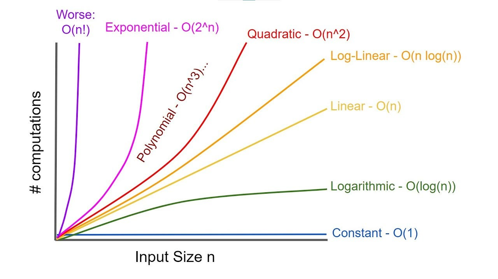

# Time & Space Complexity

* Time and Space Complexity are ways to measure how efficient an algorithm is, independent of machine, language, or input values.

## 👉 Time Complexity

* Time complexity tells you how the running time of an algorithm grows as the input size grows.
* We measure number of basic operations (comparisons, loops, assignments, etc.).
* Focus is on growth rate, not exact time.

```js
for (let i = 0; i < n; i++) {
  console.log(i);
}
```
* If `n = 10` → runs 10 times.
* If `n = 1,000,000` → runs 1,000,000 times.

## 👉 Space Complexity

* Space complexity tells you how much extra memory an algorithm uses as input size grows.
* Includes - 

    * Extra variables.
    * Arrays / objects created.
    * Recursive call stack.

## 👉 Complexity Representations

### 🎯 Big-O Notation (O) (Upper Bound)

* Worst-case complexity
* Maximum time/space an algorithm can take
* Guarantees performance will not exceed this limit.

```js
for (let i = 0; i < n; i++) {
  console.log(i);
}
```

* Runs at most n times → O(n)

### 🎯 Big-Ω Notation (Ω) (Lower Bound)

* Best-case complexity
* Minimum time/space required
* Shows the fastest possible scenario.
* Eg - Linar Search.

### 🎯 Big-Θ Notation (Θ) (Tight Bound)

* Exact bound
* When best and worst case grow at the same rate
* Most precise representation.

```js
for (let i = 0; i < n; i++) {
  console.log(i);
}
```

* `Best = n` & `Worst = n` => `Θ(N)`

## 👉 Types of Complexity

### 🎯 Constant Time - O(1)

* Execution time doesnot depend on the input size.
* Best possible time complexity.

```js
arr[5];
```

* Whether array has 10 or 10 million elements → same time.

### 🎯 Logarithmic Time - O(log n)

* Input size reduces by half each step.
* Eg - Binary Search, BST Operations.
* Very fast, even for large inputs.

```js
// Binary search concept
n → n/2 → n/4 → n/8 ...
```

### 🎯 Linear Time - O(n)

* Time grows directly proportional to input size.
* Most common and acceptable.

```js
for (let i = 0; i < n; i++) {
  console.log(i);
}
```

* 10 elements → 10 operations.
* 1M elements → 1M operations.

### 🎯 Linearithmic Time - O(n log n)

* Combination of linear + logarithmic.
* Best possible time complexity for comparison-based sorting.
* Eg - Merge Sort, Quick Sort.

### 🎯 Quadratic Time - O(n²)

* Nested loops over input.
* Becomes slow quickly for large n.

```js 
for (let i = 0; i < n; i++) {
  for (let j = 0; j < n; j++) {
    console.log(i, j);
  }
}
```

### 🎯 Cubic Time - O(n³)

* Three nested loops.
* Rarely Accepted.
* Eg - Matrix multiplication (naive).

### 🎯 Exponential Time - O(2ⁿ)

* Each input doubles the work.
* Practically unusable for large inputs.
* Eg - Fibonacci, Subset Generation.

### 🎯 Factorial Time - O(n!)

* All permutations of input.
* Worst possible growth.
* Eg - Travelling Salesman, Generating all permutations.

## 👉 How to identify Time Complexity quickly

| Code Pattern | Complexity |
| :----------: | :--------: |
| No Loop      | 0(1)       |
| Single Loop  | 0(n)       |
| Loop inside Loop     | 0(n²)       |
| Divide by 2  | 0(log n)   |
| Sorting + Loop | 0(n log n) |
| Recursive Branching      | 0(2ⁿ)       |

## 👉 Complexity Worst -> Best

* O(n!) – Factorial
* O(2ⁿ) – Exponential
* O(n³) – Cubic
* O(n²) – Quadratic
* O(n log n) – Linearithmic
* O(n) – Linear
* O(log n) – Logarithmic
* O(1) – Constant

## 👉 Complexity Graph



