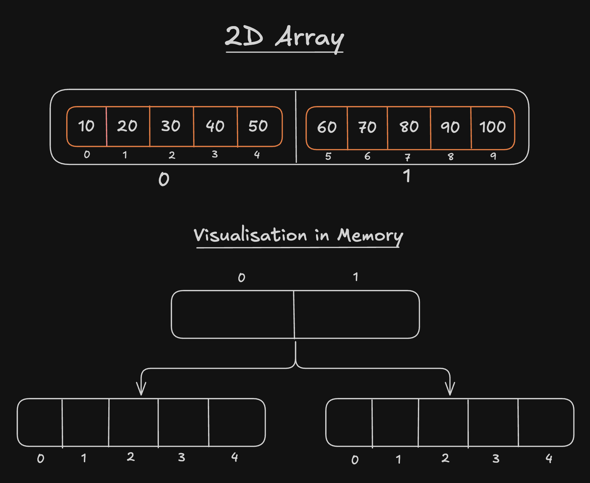
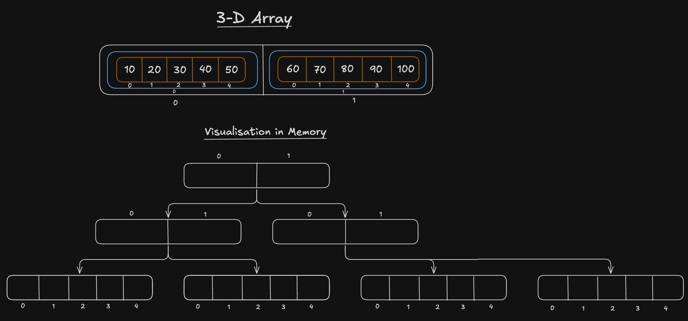

# Multi-Dimensional Array

## 👉 2-D Array



## 👉 3-D Array



### 🎯 Add elements to 2D Array

```js
function array2D(arr){
    let newArr = new Array(3);

    for(let i = 0; i < newArr.length; i++){
        newArr[i] = new Array(2);
    }

    for(let i = 0; i < newArr.length; i++){
        for(let j = 0; j < newArr[i].length; j++){
            newArr[i][j] = arr;
        }
    }

    for(let i = 0; i < newArr.length; i++){
        for(let j = 0; j < newArr[i].length; j++){
            process.stdout.write(newArr[i][j] + " ");
        }

        console.log();
    }
}

array2D([1,2]);
```

