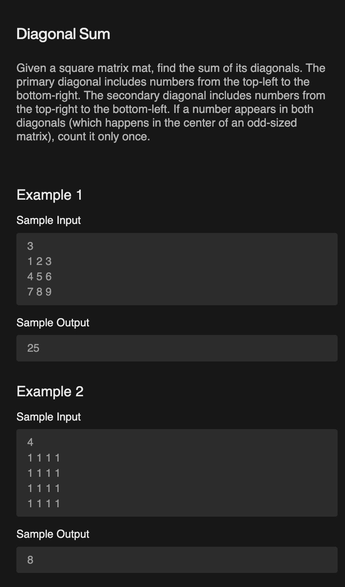
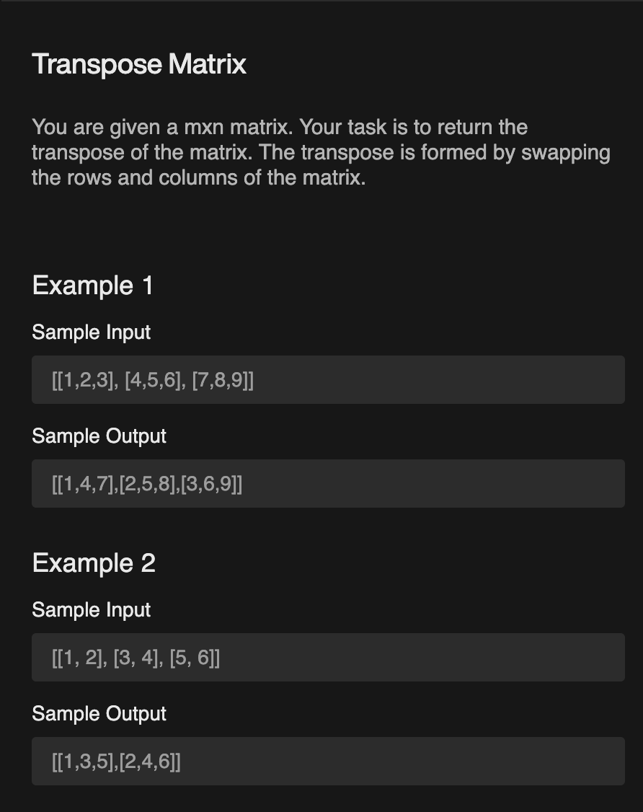
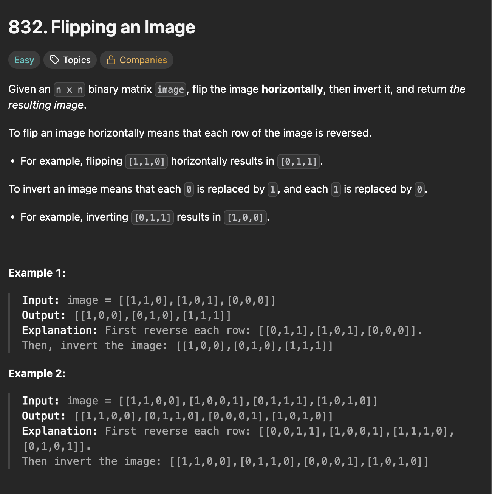
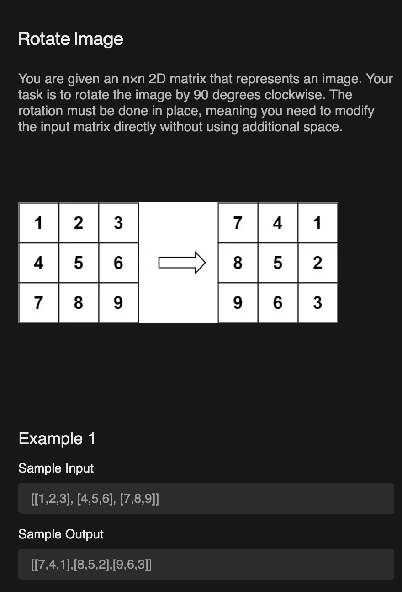
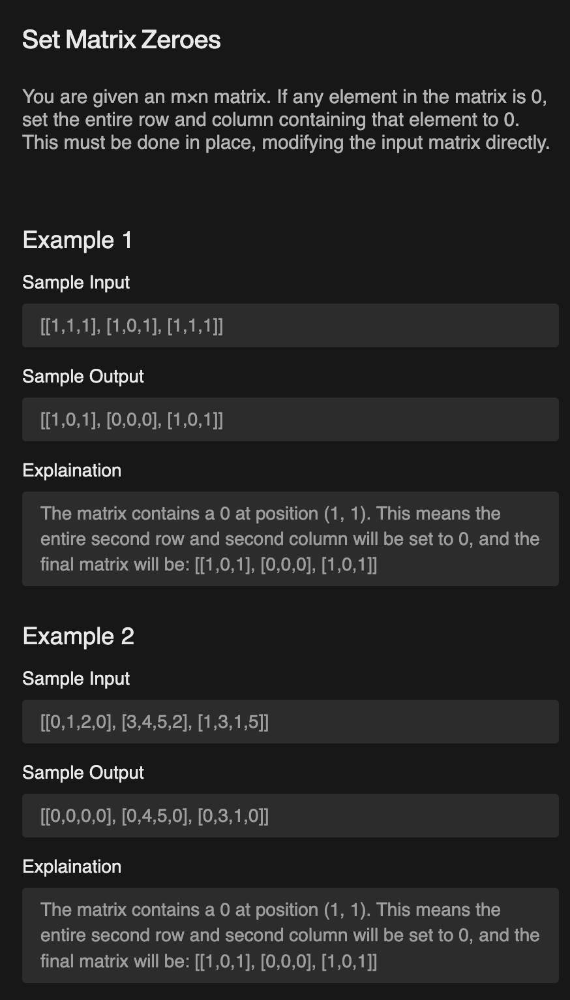

# Multi Dimensional Array Questions

## 👉 Questions

### 🎯 Diagonal Sum of a Matrix



```js
function diagonalSum(arr){
    let sum = 0;
    for(let i = 0; i < arr.length; i++){
        for(let j = 0; j < arr[i].length; j++){
            if(i == j || i+j == arr[i].length-1) sum+= arr[i][j];
        }
    }

    console.log(sum);
}

diagonalSum([[1,2,3], [4,5,6], [7,8,9]]);
```

### 🎯 Transpose of a Matrix



```js
function transpose(arr){
    let row = arr.length;
    let col = arr[0].length;

    let newArr = Array.from({length: col}, ()=> Array(row).fill(0));

    for(let i = 0; i < arr.length; i++){
        for(let j = 0; j < arr[i].length; j++){
            newArr[j][i] = arr[i][j];
            
        }
    }

    console.log(newArr);
}

transpose([[2,4,-1], [-10,5,11],[18,-7,6]]);
```

### 🎯 Flip an Image



```js
function flipImage(arr){
    for(let i = 0; i < arr.length; i++){
        let newArr = arr[i];
        let k = 0;
        let j = newArr.length - 1;

        while(k < j){
            let temp = newArr[k];
            newArr[k] = newArr[j];
            newArr[j] = temp;
            k++;
            j--;
        }
    }

    for(let i = 0; i < arr.length; i++){
        for(let j = 0; j < arr[i].length; j++){
            arr[i][j] = arr[i][j] == 0 ? 1 : 0;
        }
    }

    console.log(arr);
}
flipImage([[1,1,0],[1,0,1],[0,0,0]])
```

### 🎯 Rotate an Image



```js
function rotateImage(arr){
    // Transpose
    for(let i = 0; i < arr.length; i++){
        for(let j = i+1; j < arr[i].length; j++){
            let temp = arr[j][i];
            arr[j][i] = arr[i][j];
            arr[i][j] = temp;
        }
    }


    // Flip image
    for(let i = 0; i < arr.length; i++){
        newArr = arr[i];
        let k = 0;
        let j = newArr.length - 1;

        while(k < j){
            let temp = newArr[k];
            newArr[k] = newArr[j];
            newArr[j] = temp;
            k++;
            j--;
        }
    }

    console.log(arr);
}

rotateImage([[1,2,3],[4,5,6],[7,8,9]]);
```

### 🎯 Set Matrix Zero



```js
function matrixZero(mat){
    let row = mat.length;
    let col = mat[0].length;

    let zeroRows = new Array(row).fill(false);
    let zeroCols = new Array(col).fill(false);

    for(let i = 0; i < row; i++){
        for(let j = 0; j < col; j++){
            if(mat[i][j] == 0){
                zeroRows[i] = true;
                zeroCols[i] = true;
            }
        }
    }

    for(let i = 0; i < row; i++){
        if(zeroRows[i]){
            for(let j = 0; j < col; j++){
                mat[i][j] = 0;
            }
        }
    }

    for(let j = 0; j < col; j++){
        if(zeroCols[j]){
            for(let i = 0; i < row; i++){
                mat[i][j] = 0;
            }
        }
    }

    console.log(mat);

}

matrixZero([[0,1,2,0],[3,4,5,2],[1,3,1,5]]);
```
