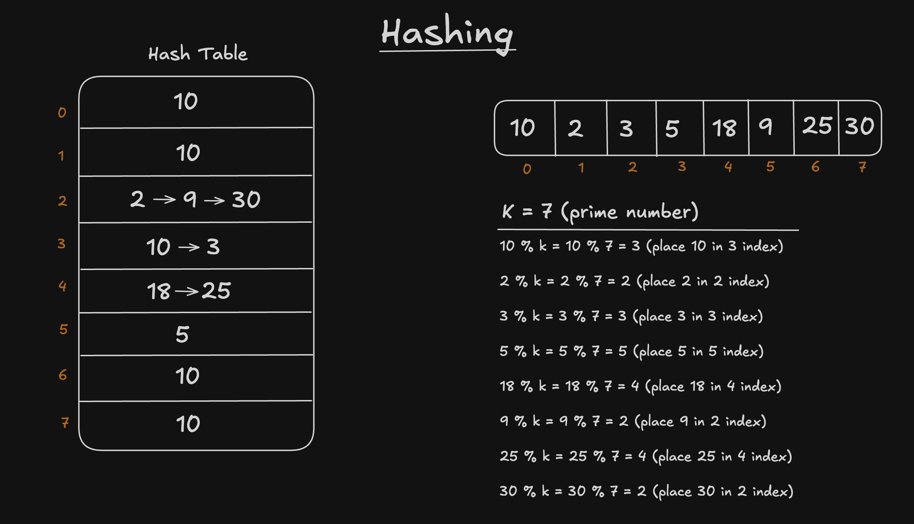

# Hashing

* Hashing is a fast way to store and find data.
* Instead of searching one-by-one, we jump directly to the place where data should be.

## 👉 Why Hashing is used?

| Technique | Array | Hashing |
|-----------|-------|---------|
| Searching | 0(n)  | Avg 0(1)|
| Deletion  | 0(n)  | Avg 0(1)|
| Insertion | 0(n)  | Avg 0(1)|

## 👉 How Hashing works?

* If we have an Array of numbers - 
* We have to create a Hash table with length equal to the Array.
* Then decide a value `k` which should be a prime number within the length of the Array, Inorder to distribute the data and minimise the collision.
* `index = k % value`

