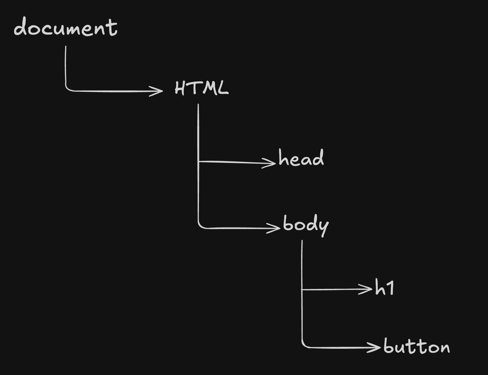

# DOM

Created time: July 23, 2025 7:45 PM
Difficulty: Intermediate
Last edited time: November 14, 2025 11:13 PM
Status: Done

- DOM stands for Document Object Model.
- It’s a **tree-like structure** that represents your **HTML document in memory**, so that JavaScript can interact with it.
- The DOM is how your browser understands and structures your HTML, so that JavaScript can **read**, **modify**, or **delete** elements on your webpage.
- Structure of DOM -
    
    
    

## 👉 Selecting Elements

### ❗️`getElementById()`

- **Selects a single element** by its **ID**.
- **Returns:** a single `HTMLElement`.

```jsx
const heading = document.getElementById("title");
```

### ❗️`getElementsByClassName()`

- Selects **multiple elements** with a given **class name**.
- **Returns:** an **HTMLCollection** (array-like, not a real array).

```jsx
const paragraphs = document.getElementsByClassName("info");
```

### ❗️**`getElementsByTagName()`**

- Selects **all elements** with a specific **tag name**.
- **Returns:** an **HTMLCollection**.

```jsx
const divs = document.getElementsByTagName("div");
```

### ❗️`querySelector()`

- **Selects the first element** that matches a **CSS selector**.
- **Returns:** a single `HTMLElement`.

```jsx
const firstInfo = document.querySelector(".info");
document.querySelector("#title");
```

### ❗️`querySelectorAll()`

- Selects **all elements** that match a CSS selector.
- **Returns:** a **NodeList** (array-like, supports `forEach`).

### ❗️Comparison Table

| Method | Returns | Supports CSS selectors | Multiple Elements | Use Case |
| --- | --- | --- | --- | --- |
| `getElementById` | Single Element | ❌ | ❌ | Fastest way to get by ID |
| `getElementsByClassName` | HTMLCollection | ❌ | ✅ | Use when you know class name |
| `getElementsByTagName` | HTMLCollection | ❌ | ✅ | Use when selecting by tag |
| `querySelector` | Single Element | ✅ | ❌ | Most flexible for one element |
| `querySelectorAll` | NodeList | ✅ | ✅ | Most flexible for multiple |

## 👉 Attribute Manipulation

### ❗️`getAttribute(attributeName)`

- **Reads** the value of a given attribute.

```jsx
<a id="link" href="https://google.com">Google</a>

const anchor = document.getElementById("link");
console.log(anchor.getAttribute("href")); // ➝ "https://google.com"
```

### ❗️`setAttribute(attributeName, value)`

- **Sets** (or updates) the value of a given attribute.

```jsx
anchor.setAttribute("href", "https://openai.com");
anchor.setAttribute("target", "_blank"); // opens in new tab
```

### ❗️`hasAttribute(attributeName)`

- Checks if an element **has** a specific attribute.

```jsx
console.log(anchor.hasAttribute("href"));  // true
console.log(anchor.hasAttribute("class")); // false
```

### ❗️`removeAttribute(attributeName)`

- **Removes** the specified attribute from the element.

```jsx
anchor.removeAttribute("target");
```

## 👉 Dynamic DOM Manipulation

### ❗️`document.createElement(tagName)`

- **Creates a new element**, but doesn't add it to the DOM yet.

```jsx
const div = document.createElement("div");
div.textContent = "Hello!";
```

### ❗️`appendChild(childNode)`

- **Adds a node as the last child** of a parent node.

```jsx
document.body.appendChild(div);
```

### ❗️`prepend(childNode)`

- **Adds a node as the first child** of a parent node.

```jsx
document.body.prepend(div);
```

### ❗️`removeChild(childNode)`

- **Removes a specific child node** from a parent.

```jsx
const parent = document.getElementById("container");
const child = document.getElementById("to-remove");
parent.removeChild(child);
```

### ❗️`append()` *(Modern & more flexible)*

- Adds one or more nodes or strings **at the end**.

```jsx
parent.append("Text", div); // You can append strings too
```

### ❗️`replaceChild(newNode, oldNode)`

- Replaces an existing child with a new one.

```jsx
parent.replaceChild(newElement, oldElement);
```

## 👉 Style updates

### ❗️`element.style.property`

- Directly set inline styles using the `style` property.

```jsx
const box = document.getElementById("box");
box.style.backgroundColor = "red";
box.style.width = "200px";
box.style.display = "flex";
```

### ❗️`element.style.cssText`

- Set **multiple styles at once** as a single string.
- Overwrites existing inline styles.

```jsx
box.style.cssText = `
  background-color: green;
  color: white;
  padding: 10px;
`;
```

### ❗️`classList.add()`

- It adds the specified class t o the element.

```jsx
box.classList.add("active");
```

### ❗️`classList.remove()`

- It removes the specified class from the element.

```jsx
box.classList.remove("active");
```

### ❗️`classList.toggle()`

- It either adds the class if not present previously or removes the class if already present.

```jsx
box.classList.toggle("dark-theme");
```